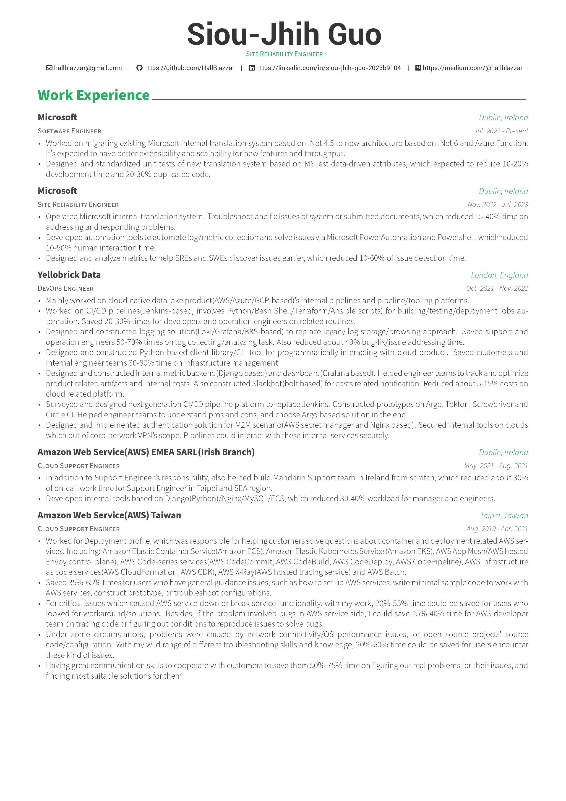
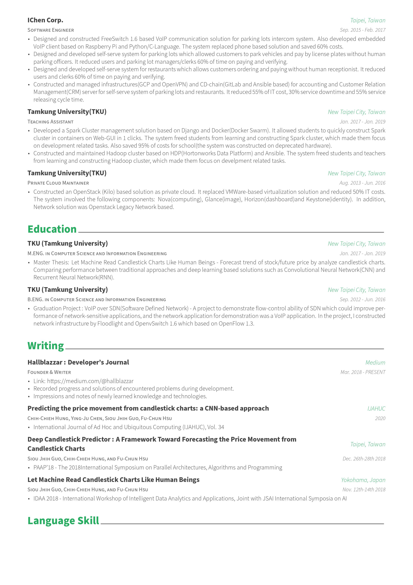
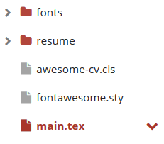
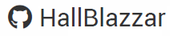

# This is resume modified from [Awesome-CV](https://github.com/posquit0/Awesome-CV) #

## How does result looked like? ##

* Check `\pdf` for more detail.

| page 1                            | page 2                            | page 3                            |
|-----------------------------------|-----------------------------------|-----------------------------------|
|  |  |  |

## Environment ##

* [Sharelatex  Docker Image](https://github.com/sharelatex/sharelatex-docker-image)
  * All available packages should be installed. (check [Quick Start Guide](https://github.com/sharelatex/sharelatex/wiki/Quick-Start-Guide#latex-environment))
  * Create empty project and upload all contents under `Resume\` where structure should be retained as Figure 1 shows.
  * Compiler should be change to `LuaLatex` otherwise `Compile Error` will be raised.

<center>
  <p>
    
  </p>
  <p>
    <em>Figure 1 :  Project structure</em>
  </p>
</center>

## How does this repository customize Awesome-CV ##

### 1. Personal information ###

In original Awesome-CV, extra personal information in third line such as gituhb homepage, phone, email are presented as Figure 2 shows.

<center>
  <p>
    
  </p>
  <p>
    <em>Figure 2 :  Example of github link</em>
  </p>
</center>

In `main.tex`, for instance, github homepage should be filled in `\github` command. Commands of different personal information are defined in `awesome-cv.cls`, such as github:

```
\href{https://github.com/\@github}{\faGithubSquare\acvHeaderIconSep\@github}
```

In this work, personal information are modified to the form as Figure 3 shows. Instead of showing only github ID on resume, showing complete link is preferred in this work. Section 1.1 and 1.2 explain how to do that.

<center>
  <p>
    
  </p>
  <p>
    <em>Figure 3 :  Example of modified github link</em>
  </p>
</center>

#### 1.1 Text and Hyperlink ####

In `awesome-cv.cls`, the code:
```
\href{https://github.com/\@github}{\faGithubSquare\acvHeaderIconSep\@github}
```
has 2 different purposes. Command `\href{}{}` is used to add text with hyperlink. First argument is hyperlink (`https://github.com/\@github`) and second argument is text (`\faGithubSquare\acvHeaderIconSep\@github`), where `\@github` is the github ID passed to `\github{}` command in `main.tex`. Directly pass complete link to `\github{}` will cause the hyperlink of text to become form below:
```
https://github.com/https://github.com/HallBlazzar
```

What this work expects is :
```
https://github.com/HallBlazzar
```

As result, first argument should be changed to `\@github` and updated command will be:
```
\href{@github}{\faGithubSquare\acvHeaderIconSep\@github}
```

### 1.2 Icon ###

#### 1.2.1 Modify Icon ####

As 1.1 introduced, In `awesome-cv.cls`, the second argument of `\href{}{}` is text to present in pdf file which form is as follows:
```
[icon] [information]
```

As example (`\faGithub\acvHeaderIconSep\@github`) shows, `[icon]` is controlled by first command (`\faGithubSquare`), second command separates `[icon]` and `[information]`(`\acvHeaderIconSep`), and third command is text to present, also the argument passed to `\github` in `main.tex`. As result, if need to use another icon for information, just directly change the first command of second argument of `\href{}{}`.In this work, some icons are modified such as `\faGithubSquare` is changed to `\faGithub`.

Note that icons which commands refer to are defined in `fontawesome.sty`. For example,  `\faGithubSquare` is the icon of github, which definition  in `fontawesom.sty` is:
```
\expandafter\def\csname faicon@git-square\endcsname {\symbol{"F1D2}} \def\faGitSquare {{\FA\csname faicon@git-square\endcsname}}
```
`\symbol` define which icon this command represents, and icon itself is selected from original `FontAwesome.ttf` based on its unicode(`F1D2`).

#### 1.2.2 Update Icon Set ####

Icons from Awesome-CV is based on  Font-Awesome 4, however, some icons are different from Font-Awesome 5 which will conflict to expected result. This section describes how to update icon to newer version.

##### 1.2.2.1 Merge Icons #####

Instead of providing single `.tff` file for importing, `.ttf` files provided by Font-Awesome 5 split all available fonts to different categories and cause include problem for Awesome-CV. If you still want to use icons from Font-Awesome5, you can follow steps below to merge `.ttf` files:

1. install [FontForge](https://fontforge.github.io/en-US/)
2. open one of target fonts first by fontforge
3. `Element -> Merge Font` to merge another font
4. `File -> Generate Font` to generate fonts

[FontDrop](https://fontdrop.info/) can help you conveniently check content of `.ttf` file instead of opening FontForge each time.

##### 1.2.2.2 Update Icon Set #####

Under Sharelatex environment, original Awesome-CV will read icons form installed  `fontawesome` package, which will cause customized Font-Awesome font unavailable. To solve the problem, the code below in `fontawesom.sty` are commented from original Awesome-CV:

```
%\newfontfamily{\FA}{FontAwesome}
```

It will force latex use fontfamily `\FA` defined in `awesome-cv.cls`, which read Font-Awesome from `\fonts\FontAwesome.ttf` instead of the one installed in system. The font generated in `1. Merge Icons` can be renamed as `FontAwesome.ttf` and used to replace original `\font\FontAwesome.ttf`, which updates original `FontAwesome.ttf`.


## 2. Color ##

### 2.1 Global Highlighting Color ###

`awesome` is the color for highlighting position, sections, and location, which
defined in `awesome-cv.cls`:
```
\colorlet{awesome}{awesome-red}
```

`awesome-red` is color pre-defined in Awesome-CV. There are also many colors pre-defined in Awesome-CV such as `awesome-orange`, `awesome-nephrities`, etc. Check `awesome-cv.cls` for more information. Awesome-CV also allow specifying `awesome` in `main.tex`, which is also by `\colorlet{}{}` command. In this work, `awesome` is set to `awesome-orange`.

### 2.2 Section color ###

Original section color defined in Awesome-CV is as Figure 4 shows. First 3 characters of each section will be highlighted by different color. However, this work prefers letting each characters uniformly coloured. Name of each section is controlled by `\cvsection` which defined in `awesome-cv.cls`:
```
\newcommand{\cvsection}[1]{%
  \vspace{\acvSectionTopSkip}
  \sectionstyle{#1}
  \phantomsection
  \color{gray}\vhrulefill{0.9pt}
}
```

<center>
  <p>
    
  </p>
  <p>
    <em>Figure 4 :  Original facade of Awesome-CV</em>
  </p>
</center>

The facade of each `\cvsection` is controlled by `\sectionstyle{}` command which argument is text of section. `\sectionstyle` is also defined in `awesome-cv.cls`, which originally defined as follows in Awesome-CV:
```
\newcommand*{\sectionstyle}[1]{{\fontsize{16pt}{1em}\bodyfont\bfseries\color{text}\@sectioncolor #1}}
```
`\color{text}` colours all texts to black and `\@sectioncolor` colours first 3 characters. To make facade of section text as Figure 5 shows, the code is modified as below to uniformly colour all texts of sections:
```
\newcommand*{\sectionstyle}[1]{{\fontsize{16pt}{1em}\bodyfont\bfseries\color{awesome} #1}}
```

<center>
  <p>
    
  </p>
  <p>
    <em>Figure 5 :  Facade of Awesome-CV of this repository</em>
  </p>
</center>
